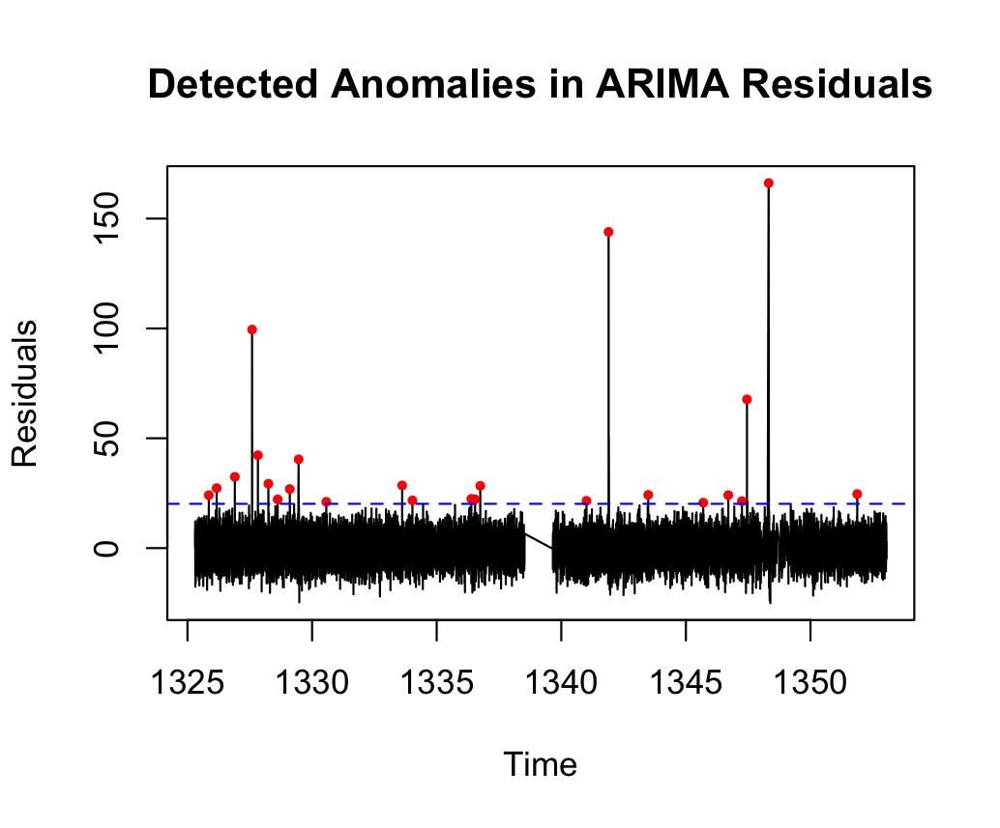
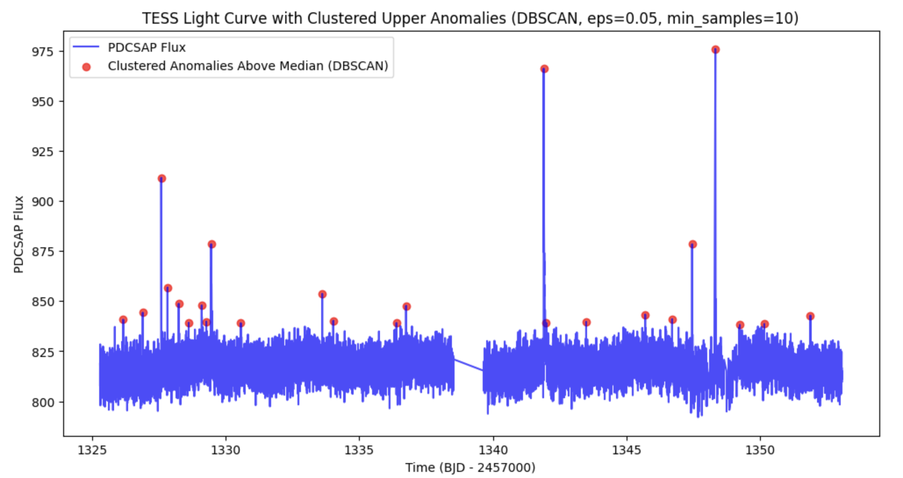
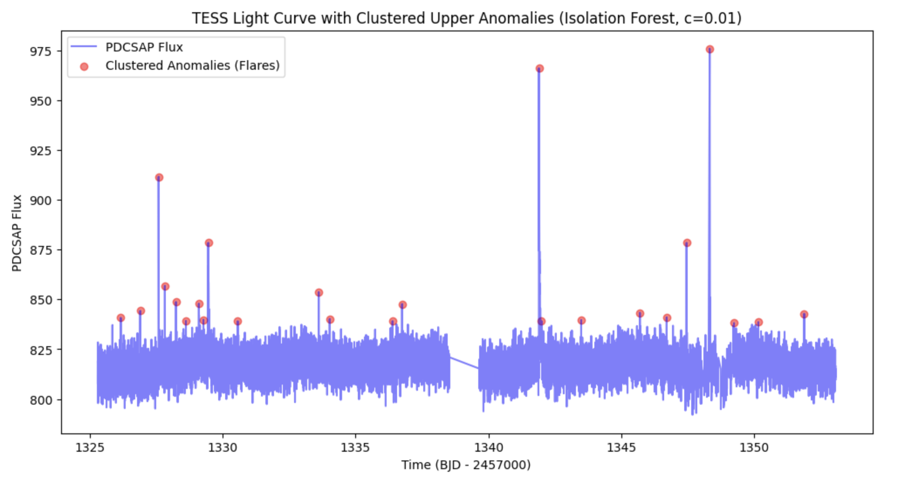
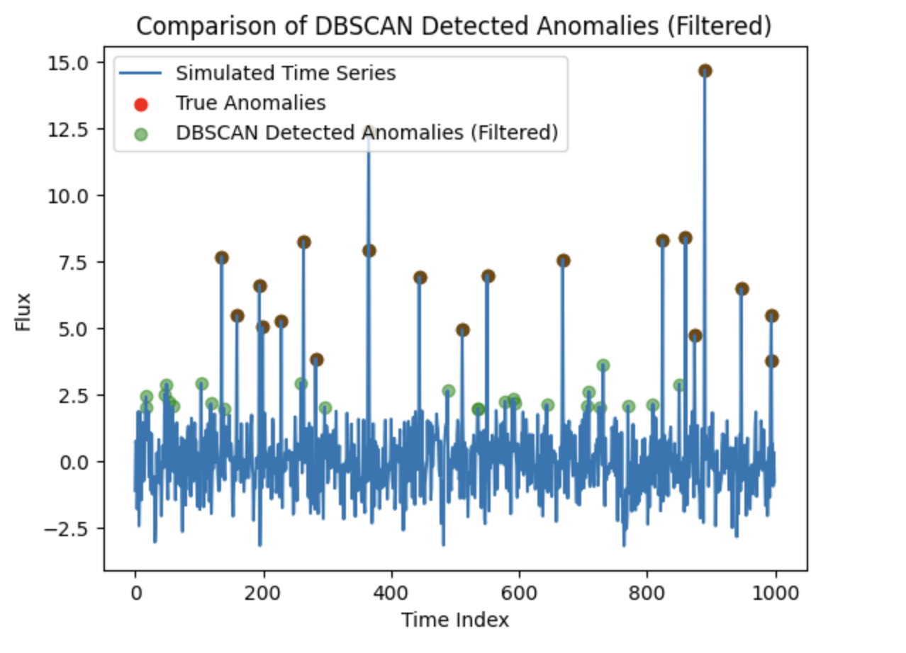
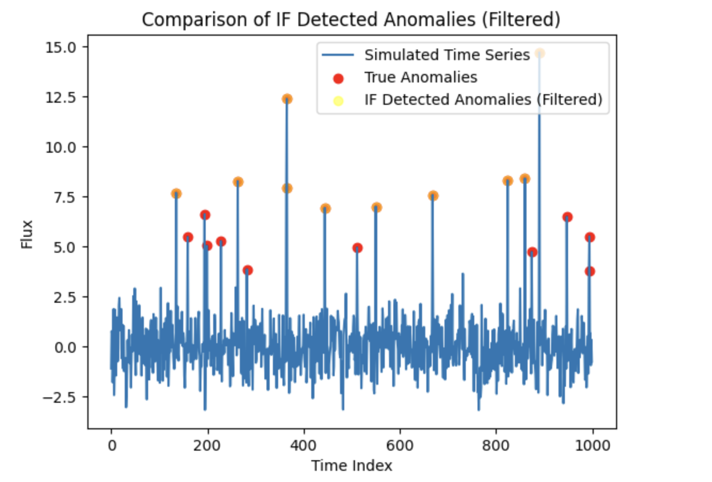

```{r setup, include=FALSE}
knitr::opts_chunk$set(echo = F, message=F, warning = F)
library(knitr)
```

# Introduction

Stellar flares are sudden, intense increases in the brightness of stars, caused by magnetic reconnection events in their atmospheres [@citeStellar]. These energetic outbursts can provide valuable insights into stellar activity and characteristics of the stars. The Transiting Exoplanet Survey Satellite (TESS) from NASA provides high-precision light curve data that can be used to detect and analyze these flares [@citeData].

In this study, we explore flare detection methods using TESS light curve data. Our approach focuses on anomaly detection methods, given the unique characteristics of flares as deviations from the typical brightness variations of a star. Specifically, we investigate time series models, DBSCAN, and Isolation Forest to detect flares based on residual and outlier identification, and density-based clustering. This study aims to assess the feasibility of unsupervised learning for stellar flare detection and evaluate the performance of different methods in identifying transient stellar events.

The remainder of this paper is structured as follows: Section \@ref(sec-data) describes data sources and visualizes data; Section \@ref(sec-methods) introduces three models and algorithms: an ARIMA model, a Isolation Forest model, and DBSCAN; discusses hyperparameter tuning and practical implementation; Section \@ref(sec-results) shows detection results of three models and compare the model performance on simulated data; Section \@ref(sec-discussion) discusses the findings and implications, as well as highlighting weaknesses and future work.


# Data {#sec-data}

To explore different anomaly detection approaches, we use light curve data for star TIC 129646813 from TESS mission, which is available on the MAST website. The dataset consists of time-series observations of stellar flux, where each observation captures the brightness of a star over time. These observations are taken at regular intervals, typically every 2 minutes (short-cadence mode), although minor irregularities or brief data gaps can occur due to spacecraft operations or instrumental effects. The time variable is recorded in Barycentric Julian Date (BJD), and the flux is measured in units of electrons per second. We use the Pre-search Data Conditioned Simple Aperture Photometry (PDCSAP) flux to conduct our analysis since it is clearer and contains less noise due to detrending manipulations. Flares appear as transient increases in flux, often characterized by a rapid rise followed by a gradual decay [@citeFlare]. In this study, we preprocess the data by removing missing values and standardizing the flux measurements using z-score normalization before applying unsupervised learning methods to identify potential flare events as anomalous deviations from the expected stellar variability. No interpolation was performed to avoid extra biases introduced and preserve the information of original dataset.

As shown in Figure \@ref(fig:data), there is a gap in time series between BJD 1338 and 1340. Since the data was collected over a regular time interval, this gap is likely due to instrumental errors. In addition, there exists a few missing values in flux near the end of the time series. After conducting an investigation and sensitivity analyses, we found that although in general for ARIMA and DBSCAN, the algorithms could not handle missing value naturally, in this case, the `auto.arima` function in package `forecast` [@citeForecast] from `R` [@citeR] and `DBSCAN` function in library `sklearn.cluster` [@citeSklearn] from `Python` [@citePython] were able to process the original data with irregular time gap after we removed the missing values at both ends of the series. For Isolation Forest, the algorithm does not require imputation and can handle missing data directly.


```{r data, out.width = "50%",fig.cap="Light Curve Time Series for TIC 129646813", fig.align='center', fig.pos="H"}
include_graphics("Figure/ts_plot_129.png")
```


# Methods {#sec-methods}
## Time Series Analysis

To analyze variability in the light curve data and detect potential flare events, we model the time series using an autoregressive integrated moving average (ARIMA) approach, which captures temporal dependencies.

An ARIMA$(p,d,q)$ model consists of [@citeARIMA]:
\begin{itemize}
    \item Autoregressive (AR) term ($p$): Captures relationships with past values.
    \item Integrated (I) term ($d$): Differencing ensures stationarity.
    \item Moving Average (MA) term ($q$): Models short-term fluctuations using past errors.
\end{itemize}

Mathematically, it is defined as:
\begin{equation}
    \Phi_p(B)(1 - B)^d Y_t = \Theta_q(B) \epsilon_t,
\end{equation}
where $B$ is the backshift operator, $\Phi_p(B)$ and $\Theta_q(B)$ are polynomials of orders $p$ and $q$, respectively, and $\epsilon_t$ is a white noise error term. This formulation enables ARIMA to model and forecast stellar brightness variations effectively.

We apply the `auto.arima` function from package `forecast` in `R` to find the best fit model based on Akaike Information Criterion (AIC) or Bayesian Information Criterion (BIC). After fitting the model, we examine the residuals and identify outliers in the residuals using a 3-sigma criterion, where points deviating more than three standard deviations from the mean residual are flagged as anomalies.

## Machine Learning Methods
### Isolation Forest

We then apply the Isolation Forest (IF), an unsupervised anomaly detection method based on recursive partitioning. The key idea is that anomalous points, being rare and different from the majority, are easier to isolate with fewer splits.

Given a dataset $X = \{x_1, x_2, \dots, x_n\}$, the Isolation Forest algorithm operates as follows [@citeIF]:
\begin{enumerate}
    \item Construct multiple isolation trees (iTrees) by recursively splitting random subsets of the data along randomly chosen features.
    \item Compute the anomaly score of each point $x$ based on its average isolation path length:
    \begin{equation}
        s(x, n) = 2^{-\frac{E(h(x))}{c(n)}}
    \end{equation}
    where $E(h(x))$ is the expected path length and $c(n)$ is a normalization factor.
    \item Points with high anomaly scores are flagged as potential outliers.
\end{enumerate}

We use the `IsolationForest` function from `sklearn.ensemble` library in `Python` to fit the time series data and visualize the anomaly detection results. For IF, the algorithm could handle the missing values and irregular time space, so we don't need further manipulation on data. The key parameter `comtamination` was chosen based on visualization.


### DBSCAN

Another common method used for anomaly detection is Density-Based Spatial Clustering of Applications with Noise (DBSCAN), a clustering algorithm that detects anomalies as points that do not belong to any dense cluster [@citeDBSCAN]. It groups data based on the density of points in a given neighborhood, making it effective for detecting local outliers.

We applied the `DBSCAN` function from `sklearn.cluster` library in `Python` to fit the time series data and visualize the anomaly detection results. Although DBSCAN typically assumes uniformly spaced data and does not naturally handle missing values, in this case, the algorithm performed well without additional imputation on the irregular time gap. The key parameters for DBSCAN `eps` (the neighborhood radius) and `min_samples` (minimum number of points to form a dense region) were tuned using grid search to capture the appropriate density structure for flare detection. 


# Results {#sec-results}
## Time Series Model

The best fit ARIMA model for the light curve data is ARIMA$(4,1,1)$, which indicates:
\begin{itemize}
    \item $p = 4$: Four lagged terms are included to account for autocorrelation.
    \item $d = 1$: Differencing is applied once to remove trends and ensure stationarity.
    \item $q = 1$: One lagged error term is included to model short-term fluctuations.
\end{itemize}

After fitting the ARIMA model, we analyzed the residuals to detect anomalies, which are interpreted as candidate flare events. Figure \@ref(fig:ts-1) shows the the detection results. The red points are the detected outliers with the blue dashed line representing the upper and lower threshold of 3 standard deviations. These high residuals suggest abrupt increases in flux not captured by the autoregressive structure of the time series and are thus considered flare candidates. To reduce redundancy and account for flare duration, we clustered the detected outliers based on temporal proximity and filtered those below the median. Specifically, we applied a time threshold of 0.02 BJD: anomalies occurring within this window were grouped together and counted as a single flare event. This threshold was chosen based on the sampling frequency of the data, which is approximately 0.001 BJD (equivalent to one observation every two minutes), ensuring that clusters represent physically plausible flare duration rather than noise.

Model diagnostics are presented in Figure \@ref(fig:ts-2).The top panel displays the raw residuals, revealing several extreme spikes corresponding to flare-like behavior. The bottom-left panel shows the autocorrelation function (ACF) of the residuals, which exhibits no significant autocorrelation, indicating that the ARIMA(4,1,1) model has adequately captured the time-dependent structure in the flux series. Finally, the bottom-right panel shows a density plot of the residuals, which is highly right-skewed, consistent with the presence of positive outliers due to flares. 

Notably, residuals around BJD 1338–1340 remain stable, with no false anomalies detected despite the irregular gap in time. This suggests that the ARIMA model is robust to the small discontinuity caused by instrumental gaps, provided the missing edge values are removed. Overall, the ARIMA model successfully differentiates between regular stellar variations and transient flare events by isolating significant positive deviations in the residuals.


```{r ts, out.width = "50%",fig.cap="ARIMA Model Results and Diagnosis",fig.subcap=c("result", "residual"), fig.align='center', fig.pos="H"}

include_graphics("Figure/res_arima_129_without_imputation.png")
```


## Machine Learning Model

### Detection results

In addition to ARIMA, we applied two unsupervised machine learning methods, DBSCAN and Isolation Forest, to detect flare events directly from the standardized PDCSAP flux time series. Figure \@ref(fig:ml) shows the the detection results.

DBSCAN was employed with hyperparameters `eps = 0.05` and `min_samples = 10`, selected based on the visualization and domain knowledge of temporal proximity between flare-related flux spikes. Silhouette score was also used to find the best combination of `eps` and `min_sample`, however, it brought a too visually conservative results. As shown in Figure \@ref(fig:ml-1), DBSCAN identified clusters of points that deviate significantly from the general flux behavior. To reduce the influence of spurious detections and align results with the physical nature of flares, we filtered out outliers that fell below the median flux. Furthermore, we applied a time-based clustering approach using a threshold of 0.02 BJD to group consecutive outliers into single flare events, same as for ARIMA model. This method successfully captured several strong flares while ignoring small noisy fluctuations.

Isolation Forest was also implemented using a contamination level of `c = 0.01`, as shown in Figure \@ref(fig:ml-2). Similar to DBSCAN, Isolation Forest anomalies were filtered to exclude fluxes below the median and clustered using the same 0.02 BJD time window. The model was able to identify prominent flare-like events and showed a high level of agreement with DBSCAN in terms of both timing and flare intensity, though a few unique events were detected by each method.

Both methods successfully identifies several anomalies with similar number of flare events. To further evaluate model performance and assess robustness across stars with similar variability patterns, we will generate simulated light curves and conduct the same detection and clustering analysis. This comparison will provide additional insight into sensitivity, false positive rates, and consistency across different anomaly detection strategies.


```{r ml, out.width = "50%",fig.cap="Machine Learning Model Results",fig.subcap=c("DBSCAN", "IF"), fig.align='center', fig.pos="H", fig.ncol=2}


```


### Simulation

To further assess the robustness and comparative performance of DBSCAN and Isolation Forest, we generated a synthetic time series mimicking the behavior of stellar light curves with injected flares. These flares were modeled as abrupt increases in flux following a heavy-tailed distribution (e.g., Pareto) to replicate the fast-rise, slow-decay pattern observed in real data. Noise was added to simulate baseline stellar variability. 

The baseline signal was generated using an ARIMA(4,1,1) process to replicate the autoregressive and non-stationary characteristics of stellar flux variations. This choice was motivated by prior modeling of the real light curve, where ARIMA(4,1,1) provided a good fit. The simulated time series contained 1,000 data points and served as the background signal in the absence of flares.

Flares were modeled as transient upward deviations from the baseline, with magnitudes drawn from a Pareto distribution. This distribution was chosen due to its heavy-tailed nature, which is consistent with the physical behavior of stellar flares—rare but potentially large flux increases. Specifically, we sampled 20 potential flare magnitudes using a Pareto distribution with shape parameter 3 and scale parameter 5. These anomalies were injected at random time points within the simulated series, excluding the initial 100 points to avoid edge effects from the autoregressive structure. To ensure physical realism, only anomalies that caused the flux to rise above the median of the baseline time series were retained. This step filtered out weak anomalies that would not be distinguishable from background variability.

The final simulated time series included injected anomalies that were sparse, positive, and of varying intensity—closely resembling flare behavior seen in actual observations. Each valid anomaly was added to the corresponding location in the baseline series. The indices of these injected anomalies were recorded as the ground truth for model evaluation. This allowed us to compute detection metrics such as the True Positive Rate (TPR) and False Positive Rate (FPR) by comparing model outputs to known anomaly locations.

Figure \@ref(fig:sim) show the results of anomaly detection on the simulated dataset. Figure \@ref(fig:sim-1) shows the output from DBSCAN after filtering and time-based clustering, with detected anomalies (green) overlaid on true injected flares (red). The majority of the true anomalies were correctly identified, and DBSCAN effectively captured the most prominent flare events. However, a few false positives are visible as there exists points flagged as anomalies that do not correspond to any injected event. These are generally lower-amplitude deviations near the threshold, indicating that DBSCAN, while sensitive, may also be prone to over-detection in noisier regions. Figure \@ref(fig:sim-2) presents the corresponding results from the Isolation Forest model using the same post-processing approach where detected anomalies (yellow) are again plotted alongside true anomalies (red). This method exhibited a more conservative detection behavior. Although all detected points correspond to true anomalies (indicating no false positives), several injected anomalies, particularly those of lower intensity, were missed. This suggests that Isolation Forest is more specific but less sensitive, likely prioritizing robustness over recall.


```{r sim, out.width = "50%",fig.cap="Simulation Results for Machine Learning Models",fig.subcap=c("DBSCAN", "IF"), fig.align='center', fig.pos="H", fig.ncol=2}


```

To quantify performance, we computed the True Positive Rate (TPR) and False Positive Rate (FPR) for each model, as shown in Table \@ref(tab:compare). DBSCAN achieved a TPR of 0.95, accurately identifying nearly all injected flares, but with a small FPR of 0.0255, indicating some sensitivity to noise. In contrast, Isolation Forest showed perfect specificity with an FPR of 0.0 but detected only half of the true flare events (TPR = 0.5), suggesting it is more conservative in flagging anomalies.

These findings suggest a trade-off between sensitivity and specificity across the two methods. DBSCAN is more aggressive and may over-flag events, while Isolation Forest is more conservative but risks missing subtle flares. The choice between the two may therefore depend on the tolerance for false positives in context of stellar flare.

\begin{table}[ht] 
\centering 
\caption{Performance comparison between Isolation Forest and DBSCAN on Simulated Data} \label{tab:compare} 
\begin{tabular}{lcc} 
\hline 
Model & TPR & FPR \\
\hline 
Isolation Forest & 0.5 & 0.0 \\
DBSCAN & 0.95 & 0.0255 \\
\hline 
\end{tabular} 
\end{table}

# Discussion {#sec-discussion}

## Summary

In this study, we explored multiple unsupervised learning techniques to detect stellar flare events in the TESS light curve data for star TIC 129646813. By modeling stellar variability using ARIMA and comparing it with machine learning-based anomaly detection methods, DBSCAN and Isolation Forest, we demonstrated that flares can be effectively identified as statistically significant deviations from baseline flux behavior.

The ARIMA(4,1,1) model captured the underlying autocorrelated structure of the stellar flux and allowed us to isolate positive residuals that potentially correspond to flare events. Anomalies detected in the residuals aligned well with expected flare characteristics and the model accouts for noise and autoregressive trends.

Both DBSCAN and Isolation Forest successfully identified flare-like events directly from the flux time series, each with distinct strengths. DBSCAN exhibited high sensitivity and was able to detect a greater number of flares, including those of smaller magnitude, while Isolation Forest offered strong specificity and zero false positives. These observations were supported by a simulation study with simulated time series and injected anomalies based on a Pareto distribution. DBSCAN achieved a high true positive rate of 0.95, while Isolation Forest achieved a perfect false positive rate of 0.0, illustrating a clear trade-off between detection sensitivity and precision.


## Limitations and Future Work

However, there are several limitations should be noted. One of the primary challenges is the absence of ground truth flare labels in the real dataset, which restricts validation to indirect methods such as visual inspection and comparison to expected flare behavior. Additionally, both DBSCAN and Isolation Forest are sensitive to the choice of hyperparameters. In the absence of labeled training data, these parameters needs be chosen based on visual diagnostics or domain knowledge, which may not generalize well to other stars or datasets. Small changes in `eps` or `min_samples` for DBSCAN, or the contamination level for Isolation Forest, can significantly affect the number and nature of detected anomalies.

For ARIMA models, while residual-based detection highlights deviations from expected stellar behavior, it assumes a consistent and stationary structure in the differenced time series. Irregular gaps in the time domain, or large flux variations between adjacent observations, can disrupt this structure and result in misleading residuals. This sensitivity to temporal regularity means that ARIMA-based flare detection can underperform in datasets with interruptions or instrumental noise.

The simulation setup, although designed to reflect flare-like anomalies, does not fully capture the complex behaviour of actual stellar flares, including asymmetries, decay times, and overlapping events. Flares were modeled as instantaneous positive deviations with magnitudes sampled from a Pareto distribution. In reality, stellar flares exhibit more complex temporal morphology, including asymmetric profiles, smooth rise and decay phases, and the possibility of overlapping events [@citeFlare]. As a result, the simulation may underestimate the difficulty of detecting more subtle or blended anomalies in real observational data.


Building on this analysis, there are several directions that could extend and improve the current analysis. Applying the developed methods across a larger and more diverse sample of TESS stars would help evaluate generalization and robustness, and highlight potential model limitations in different settings. Incorporating physical characteristics of flares, such as rise and decay profiles, into the detection process could reduce false positives and improve alignment with astrophysical interpretation. Additionally, combining unsupervised methods with limited human-labeled data or astrophysical priors through semi-supervised or weakly supervised learning frameworks may enhance both detection accuracy and interpretability. 


\newpage
# Reference
<div id="refs"></div>
