```{r setup, include=FALSE}
knitr::opts_chunk$set(echo = F, message=F, warning = F)
library(knitr)
```

# Introduction

Stellar flares are sudden, intense increases in the brightness of stars, caused by magnetic reconnection events in their atmospheres. These energetic outbursts can provide valuable insights into stellar activity and characteristics of the stars. The Transiting Exoplanet Survey Satellite (TESS) from NASA provides high-precision light curve data that can be used to detect and analyze these flares.

In this study, we explore flare detection methods using TESS light curve data. Our approach focuses on anomaly detection methods, given the unique characteristics of flares as deviations from the typical brightness variations of a star. Specifically, we investigate time series models, DBSCAN, Gaussian Mixture Models (GMM), and Isolation Forest to detect flares based on residual and outlier identification, and density-based clustering. This study aims to assess the feasibility of unsupervised learning for stellar flare detection and evaluate the performance of different methods in identifying transient stellar events.


# Data

To explore different anomaly detection approaches, we use light curve data for star TIC 129646813 from TESS mission, which is available on the MAST website. The dataset consists of time-series observations of stellar flux, where each observation captures the brightness of a star over time. These observations are taken at regular intervals, typically every 2 minutes (short-cadence mode). We use the Pre-search Data Conditioned Simple Aperture Photometry (PDCSAP) flux to conduct our analysis since it is clearer and contains less noise due to detrending manipulations. Flares appear as transient increases in flux, often characterized by a rapid rise followed by a gradual decay. In this study, we preprocess the data to handle missing values and standardize the flux measurements before applying unsupervised learning methods to identify potential flare events as anomalous deviations from the expected stellar variability.

As shown in Figure \@ref(fig:data-1), there is a gap in time between 1338 and 1340. Since the data was collected over a regular time interval, such gap may due to instrumental errors. Also, there exists a few missing values in flux at the end of the time series. Since for some methods we are interested in, such as ARIMA and DBSCAN, the algorithm could not handle missing value naturally, thus we need to either remove or impute the missing values. As shown in Figure \@ref(fig:data-2), the yellow line represents the imputation result using ARIMA interpolation in `imputeTS` package in R. It fills both the gap in time and missing values in flux.

When imputing the missing values, we assume that the behaviour of the star's flux has the same pattern as it was before the gap and after the gap However, to validate the necessity of imputation, the following analysis will compare the model results for both imputed data and original data.

```{r data, out.width = "50%",fig.cap="Light curve time series for TIC 129646813",fig.subcap=c("original", "with imputation"), fig.align='center', fig.pos="H"}
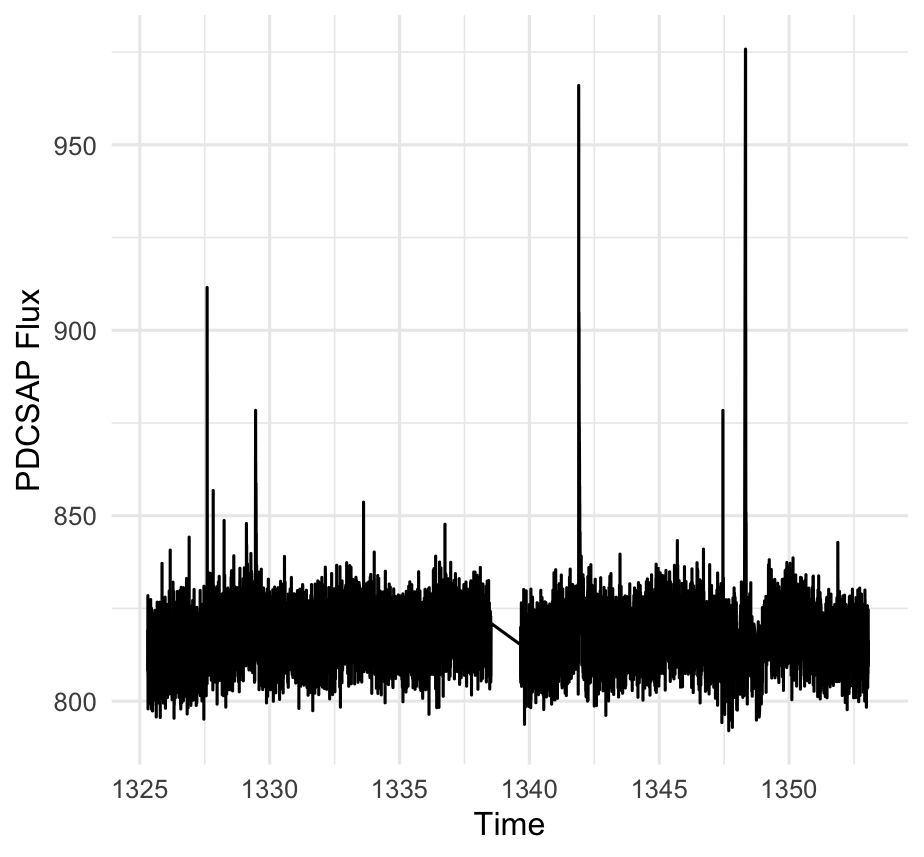
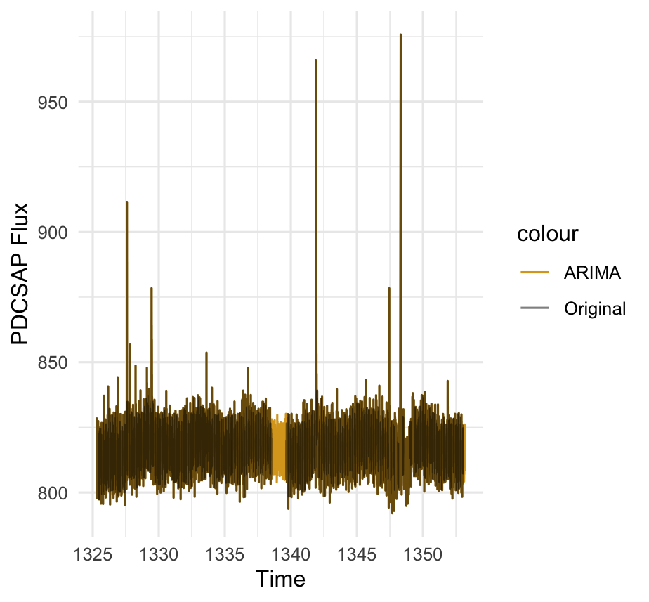
```


# Methods
## Time Series Analysis

To analyze the variability in the light curve data and identify potential flare events, we first model the time series using an autoregressive integrated moving average (ARIMA) approach, which could capture the temporal dependencies in the data.

An ARIMA$(p,d,q)$ model consists of three components:
\begin{itemize}
    \item \textbf{Autoregressive (AR) term ($p$)}: The current value of the time series is expressed as a linear function of its previous values, capturing persistent trends.
    \item \textbf{Integrated (I) term ($d$)}: Differencing is applied to the time series $d$ times to achieve stationarity, meaning that statistical properties (such as mean and variance) remain constant over time.
    \item \textbf{Moving Average (MA) term ($q$)}: The model includes a linear combination of past forecast errors to account for short-term fluctuations.
\end{itemize}

Mathematically, an ARIMA$(p,d,q)$ model is defined as:
\begin{equation}
    \Phi_p(B)(1 - B)^d Y_t = \Theta_q(B) \epsilon_t,
\end{equation}
where:
\begin{itemize}
    \item $B$ is the backshift operator, such that $B Y_t = Y_{t-1}$,
    \item $\Phi_p(B)$ is the autoregressive polynomial of order $p$,
    \item $\Theta_q(B)$ is the moving average polynomial of order $q$,
    \item $\epsilon_t$ is a white noise error term with mean zero and constant variance.
\end{itemize}

We apply the `auto.arima` function to find the best fit model based on Akaike Information Criterion (AIC) or Bayesian Information Criterion (BIC). After fitting the model, we examine the residuals and identify outliers in the residuals using a 3-sigma criterion, where points deviating more than three standard deviations from the mean residual are flagged as anomalies.

## Machine Learning Methods
### Isolation Forest

To further identify potential stellar flares in the TESS light curve data, we apply an unsupervised anomaly detection method known as the Isolation Forest (IF). The Isolation Forest method is based on recursive partitioning of the data, where an ensemble of randomly constructed binary trees is used to isolate data points. It is based on the assumption that because anomalous points, which are rare and significantly different from the majority, they can be isolated using few partitions.

Given a dataset $X = \{x_1, x_2, \dots, x_n\}$ with $d$ features, the Isolation Forest algorithm operates as follows:
\begin{enumerate}
    \item Select a subset of the data and repeat randomly splitting the data on randomly chosen features until each instance is isolated.
    \item A collection of isolation trees (iTrees) is built, where each tree represents a different partitioning of the data.
    \item The anomaly score of a data point $x$ is computed based on the average path length required to isolate $x$ across all trees. The anomaly score is defined as:
    \begin{equation}
        s(x, n) = 2^{-\frac{E(h(x))}{c(n)}}
    \end{equation}
    where:
    \begin{itemize}
        \item $E(h(x))$ is the expected path length of $x$,
        \item $c(n)$ is the average path length of an unsuccessful search in a binary tree of size $n$.
    \end{itemize}
    Data points with high anomaly scores are flagged as potential outliers.
\end{enumerate}

We use the `IsolationForest` function fro `sklearn` library in Python to fit the time series data and visualize the anomaly detection results. For IF, the algorithm could handle the missing values and irregular time space, so we don't need furthur manipulation on data.

### Gaussian Mixture Model

\subsection{Anomaly Detection with Gaussian Mixture Model}

To identify stellar flares in the TESS light curve data, we apply the \textit{Gaussian Mixture Model} (GMM), a probabilistic model that represents the distribution of the data as a mixture of multiple Gaussian components. GMM is widely used for clustering and anomaly detection, as it provides a flexible way to model complex distributions.

\subsubsection{Gaussian Mixture Model Formulation}

The GMM assumes that the observed data $\mathcal{X} = \{x_1, x_2, \dots, x_n\}$ follows a mixture of $K$ Gaussian distributions, each defined by its mean and covariance. The probability density function (PDF) for a given data point $x$ is given by:

\begin{equation}
    p(x) = \sum_{k=1}^{K} \pi_k \mathcal{N}(x \mid \mu_k, \Sigma_k),
\end{equation}

where:
\begin{itemize}
    \item $K$ is the number of Gaussian components in the mixture,
    \item $\pi_k$ represents the mixing weight of the $k$-th Gaussian, subject to $\sum_{k=1}^{K} \pi_k = 1$,
    \item $\mathcal{N}(x \mid \mu_k, \Sigma_k)$ is the Gaussian distribution with mean $\mu_k$ and covariance matrix $\Sigma_k$:
    \begin{equation}
        \mathcal{N}(x \mid \mu_k, \Sigma_k) = \frac{1}{(2\pi)^{d/2} |\Sigma_k|^{1/2}} \exp \left( -\frac{1}{2} (x - \mu_k)^T \Sigma_k^{-1} (x - \mu_k) \right).
    \end{equation}
\end{itemize}

The parameters of the GMM ($\pi_k$, $\mu_k$, and $\Sigma_k$) are estimated using the \textit{Expectation-Maximization} (EM) algorithm, which iteratively refines the parameters by maximizing the likelihood of the observed data.

\subsubsection{Implementation and Outlier Detection}

For this study, we apply the GMM to the TESS light curve data, treating flux values as observations to be modeled as a mixture of normal distributions. The steps involved are:

\begin{itemize}
    \item \textbf{Preprocessing:} The flux values are normalized to ensure consistency in clustering.
    \item \textbf{Model Fitting:} A GMM is trained with varying numbers of components $K$, selecting the optimal number using the Bayesian Information Criterion (BIC) or Akaike Information Criterion (AIC).
    \item \textbf{Anomaly Scoring:} The likelihood of each data point is computed under the fitted GMM, where lower likelihood values indicate deviations from the learned distribution.
    \item \textbf{Thresholding:} A threshold is determined empirically, and points with the lowest likelihoods are classified as anomalies.
\end{itemize}

By visualizing the probability density function and comparing flagged anomalies with those identified using ARIMA and Isolation Forest, we evaluate the effectiveness of GMM in detecting stellar flares. Since flares are transient increases in brightness, they are expected to belong to a low-probability region of the modeled flux distribution, making GMM a suitable approach for anomaly detection in this context.


### DBSCAN

\subsection{Anomaly Detection with DBSCAN}

To identify stellar flares in the TESS light curve data, we apply the \textit{Density-Based Spatial Clustering of Applications with Noise} (DBSCAN) algorithm. DBSCAN is a clustering method that groups data points based on their density and can effectively detect anomalies as points that do not belong to any dense cluster. This makes it well-suited for detecting flares, which are expected to be rare and significantly different from normal stellar variability.

\subsubsection{DBSCAN Algorithm}

DBSCAN classifies data points into three categories:
\begin{itemize}
    \item \textbf{Core points}: Points that have at least a minimum number of neighbors within a specified distance.
    \item \textbf{Border points}: Points that are within the neighborhood of a core point but do not meet the density criteria themselves.
    \item \textbf{Noise (Outliers)}: Points that do not belong to any cluster, often representing anomalies.
\end{itemize}

The algorithm operates as follows:
\begin{enumerate}
    \item \textbf{Neighborhood Identification}: For each point $x_i$, count the number of points within a predefined distance $\epsilon$.
    \item \textbf{Cluster Formation}: If $x_i$ has at least $MinPts$ neighbors, it is a \textit{core point}, and a new cluster is formed.
    \item \textbf{Density Expansion}: The cluster is expanded by recursively adding reachable core and border points.
    \item \textbf{Outlier Detection}: Points that are not assigned to any cluster are classified as anomalies.
\end{enumerate}

\subsubsection{Implementation and Outlier Detection}

For this study, we apply DBSCAN to the TESS light curve data, treating flux values as input for clustering and anomaly detection. The implementation consists of the following steps:

\begin{itemize}
    \item \textbf{Preprocessing:} The flux values are standardized to ensure consistent distance measurements.
    \item \textbf{Hyperparameter Selection:} The parameters $\epsilon$ (neighborhood radius) and $MinPts$ (minimum points required for a core point) are chosen empirically or using techniques such as the k-distance plot.
    \item \textbf{Clustering:} DBSCAN is applied to group similar flux values and identify low-density regions as outliers.
    \item \textbf{Anomaly Classification:} Points labeled as noise (outliers) by DBSCAN are flagged as potential stellar flares.
\end{itemize}

By comparing DBSCAN-identified outliers with anomalies detected using ARIMA, Isolation Forest, and Gaussian Mixture Models, we evaluate the algorithm’s effectiveness in identifying transient flux variations. Since flares appear as sudden brightness spikes, they are expected to reside in low-density regions, making DBSCAN a useful method for detecting them.


# Results
## Time Series Model
For this study, we apply the \texttt{auto.arima} function to select an optimal ARIMA model based on the Akaike Information Criterion (AIC) or Bayesian Information Criterion (BIC). The selected model for the light curve data is ARIMA$(4,1,1)$, which indicates:
\begin{itemize}
    \item $p = 4$: Four lagged terms are included to account for autocorrelation.
    \item $d = 1$: Differencing is applied once to remove trends and ensure stationarity.
    \item $q = 1$: One lagged error term is included to model short-term fluctuations.
\end{itemize}
### With Missing Value Imputation
```{r ts, out.width = "50%",fig.cap="model results",fig.subcap=c("result", "residual"), fig.align='center', fig.pos="H"}
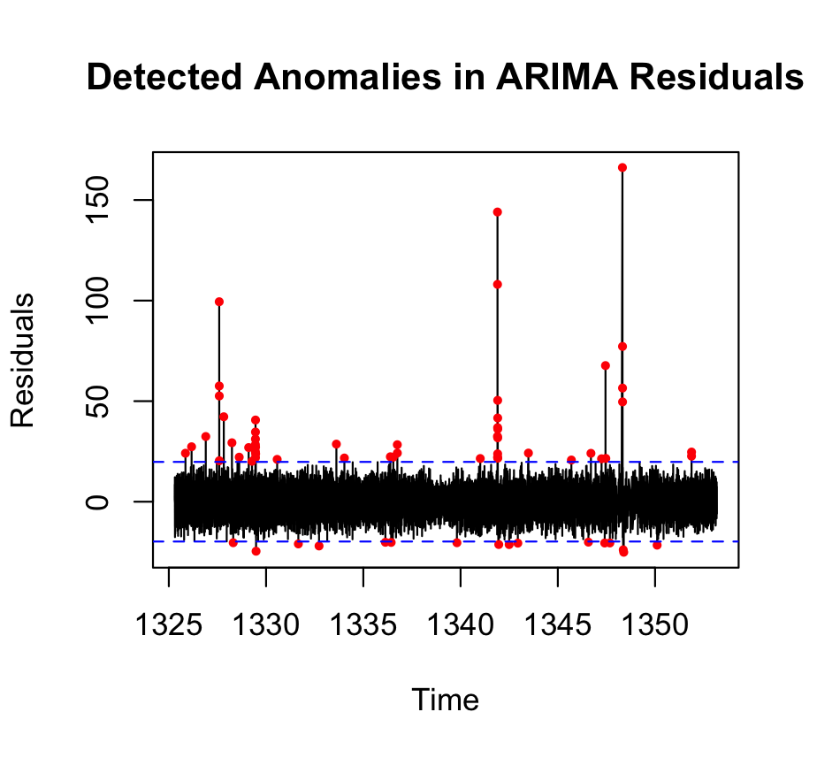
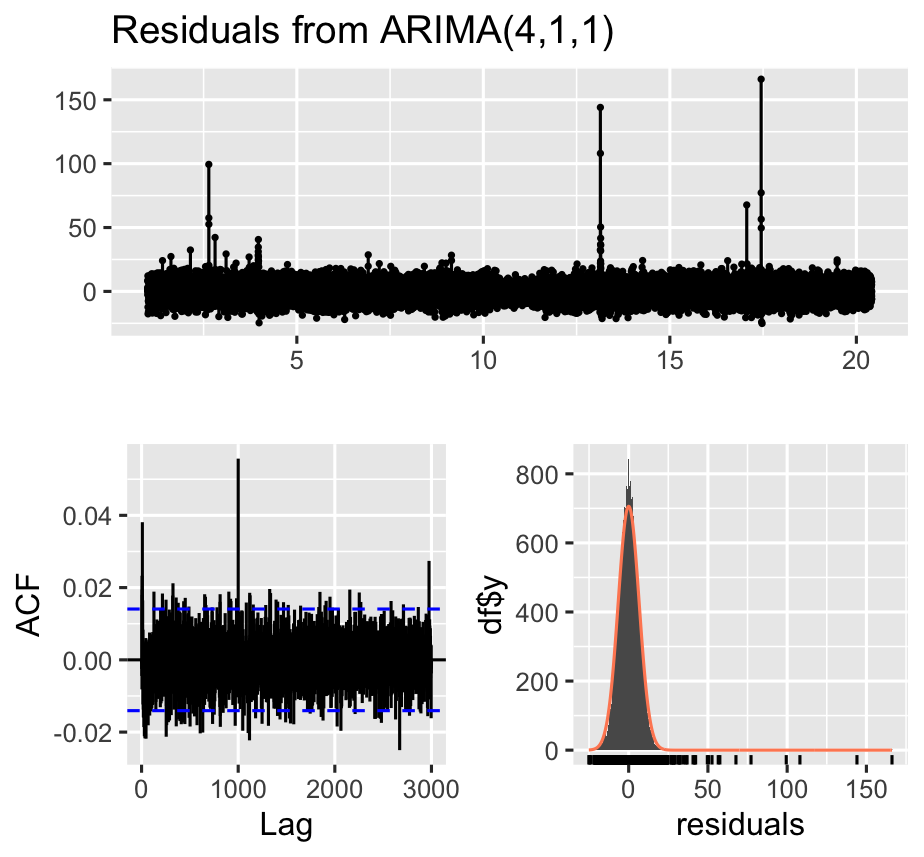
```

### Without Missing Value Imputation
```{r ts2, out.width = "50%",fig.cap="model results",fig.subcap=c("result", "residual"), fig.align='center', fig.pos="H"}
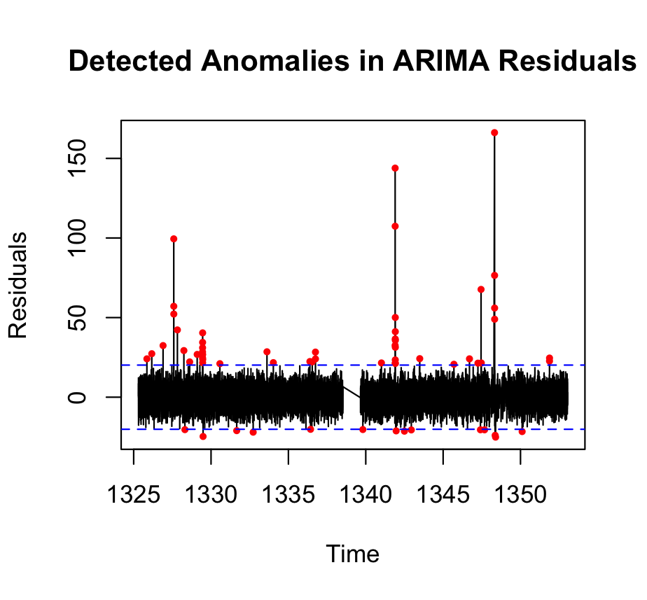
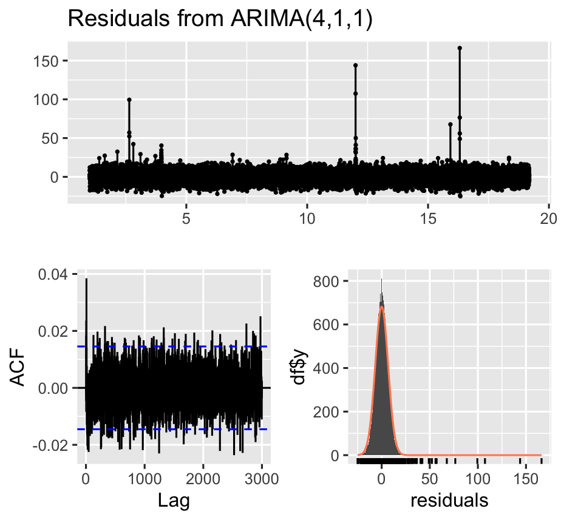
```

## Machine Learning Model
### With Missing Value Imputation
```{r ml, out.width = "50%",fig.cap="model results",fig.subcap=c("if", "gmm", "dbscan"), fig.align='center', fig.pos="H", fig.ncol=2}
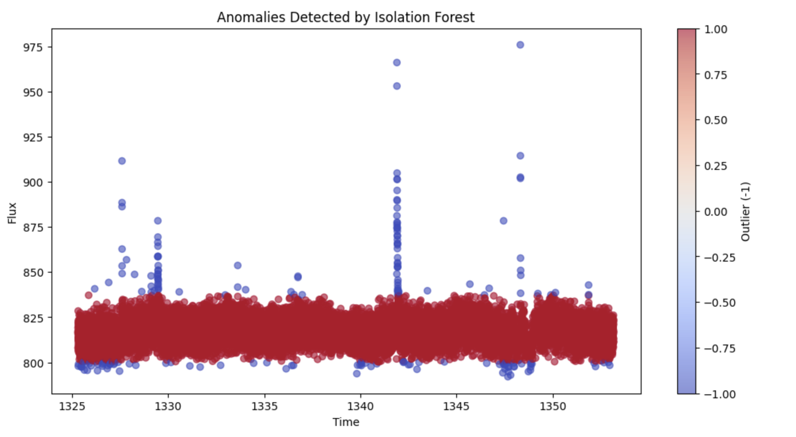
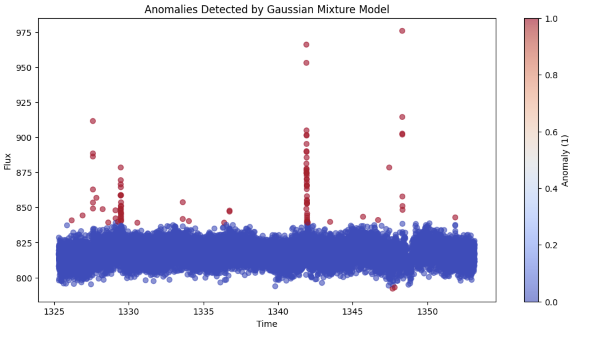
include_graphics("Figure/DBSCAN_1_129.png")
```

### Without Missing Value Imputation
```{r ml2, out.width = "50%",fig.cap="model results",fig.subcap=c("if", "gmm", "dbscan"), fig.align='center', fig.pos="H", fig.ncol=2}
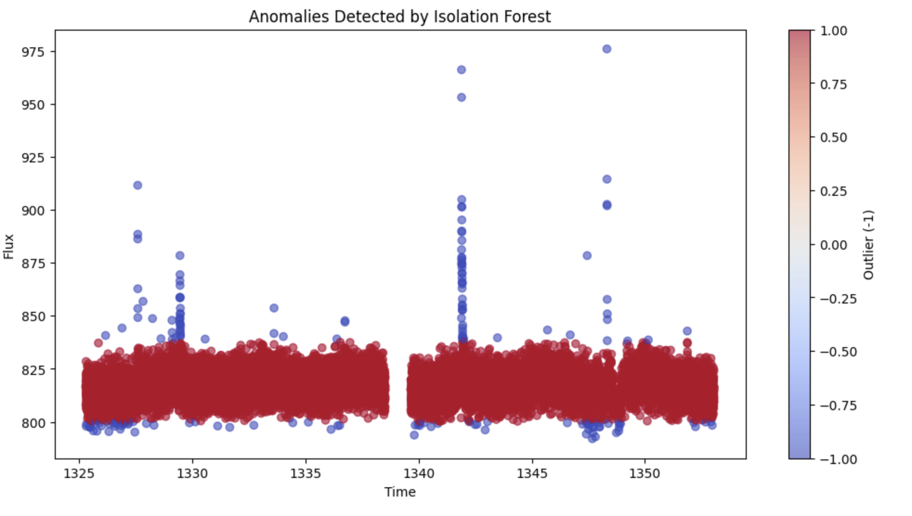
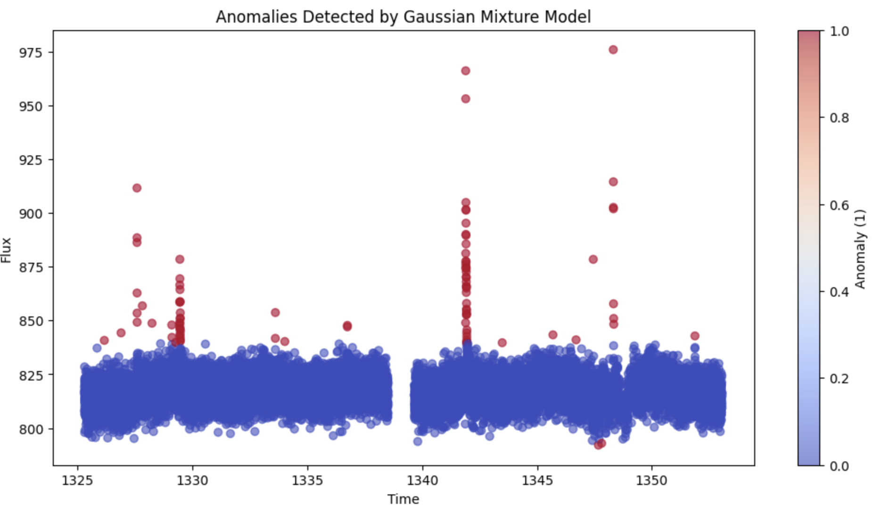
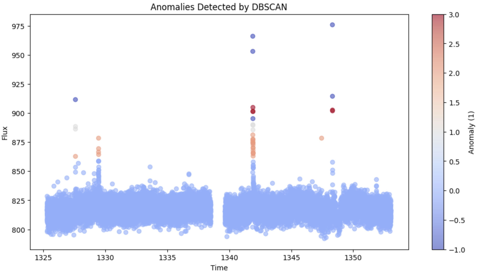
```

## Comparison

# Discussion
## Current Work
decide to use no imputation data, why
sensitivity analysis

## Next Steps

Tune parameter

decide validation and metric to compare model performance

