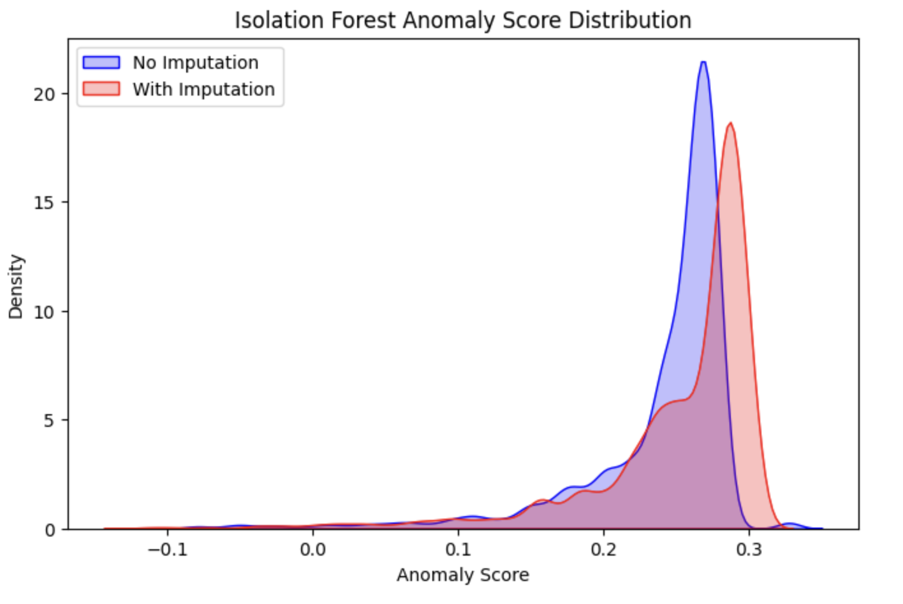

```{r setup, include=FALSE}
knitr::opts_chunk$set(echo = F, message=F, warning = F)
library(knitr)
```

# Introduction

Stellar flares are sudden, intense increases in the brightness of stars, caused by magnetic reconnection events in their atmospheres. These energetic outbursts can provide valuable insights into stellar activity and characteristics of the stars. The Transiting Exoplanet Survey Satellite (TESS) from NASA provides high-precision light curve data that can be used to detect and analyze these flares.

In this study, we explore flare detection methods using TESS light curve data. Our approach focuses on anomaly detection methods, given the unique characteristics of flares as deviations from the typical brightness variations of a star. Specifically, we investigate time series models, DBSCAN, Gaussian Mixture Models (GMM), and Isolation Forest to detect flares based on residual and outlier identification, and density-based clustering. This study aims to assess the feasibility of unsupervised learning for stellar flare detection and evaluate the performance of different methods in identifying transient stellar events.


# Data

To explore different anomaly detection approaches, we use light curve data for star TIC 129646813 from TESS mission, which is available on the MAST website. The dataset consists of time-series observations of stellar flux, where each observation captures the brightness of a star over time. These observations are taken at regular intervals, typically every 2 minutes (short-cadence mode). We use the Pre-search Data Conditioned Simple Aperture Photometry (PDCSAP) flux to conduct our analysis since it is clearer and contains less noise due to detrending manipulations. Flares appear as transient increases in flux, often characterized by a rapid rise followed by a gradual decay. In this study, we preprocess the data to handle missing values and standardize the flux measurements before applying unsupervised learning methods to identify potential flare events as anomalous deviations from the expected stellar variability.

As shown in Figure \@ref(fig:data-1), there is a gap in time between 1338 and 1340. Since the data was collected over a regular time interval, such gap may due to instrumental errors. Also, there exists a few missing values in flux at the end of the time series. Since for some methods we are interested in, such as ARIMA and DBSCAN, the algorithm could not handle missing value naturally, thus we need to either remove or impute the missing values. As shown in Figure \@ref(fig:data-2), the yellow line represents the imputation result using ARIMA interpolation in `imputeTS` package in R. It fills both the gap in time and missing values in flux.

When imputing the missing values, we assume that the behaviour of the star's flux has the same pattern as it was before the gap and after the gap However, to validate the necessity of imputation, the following analysis will compare the model results for both imputed data and original data.

```{r data, out.width = "50%",fig.cap="Light curve time series for TIC 129646813",fig.subcap=c("original", "with imputation"), fig.align='center', fig.pos="H"}

include_graphics("Figure/ARIMA_ImputeTS_129.png")
```


# Methods
## Time Series Analysis

To analyze variability in the light curve data and detect potential flare events, we model the time series using an autoregressive integrated moving average (ARIMA) approach, which captures temporal dependencies.

An ARIMA$(p,d,q)$ model consists of:
\begin{itemize}
    \item Autoregressive (AR) term ($p$): Captures relationships with past values.
    \item Integrated (I) term ($d$): Differencing ensures stationarity.
    \item Moving Average (MA) term ($q$): Models short-term fluctuations using past errors.
\end{itemize}

Mathematically, it is defined as:
\begin{equation}
    \Phi_p(B)(1 - B)^d Y_t = \Theta_q(B) \epsilon_t,
\end{equation}
where $B$ is the backshift operator, $\Phi_p(B)$ and $\Theta_q(B)$ are polynomials of orders $p$ and $q$, respectively, and $\epsilon_t$ is a white noise error term. This formulation enables ARIMA to model and forecast stellar brightness variations effectively.

We apply the `auto.arima` function to find the best fit model based on Akaike Information Criterion (AIC) or Bayesian Information Criterion (BIC). After fitting the model, we examine the residuals and identify outliers in the residuals using a 3-sigma criterion, where points deviating more than three standard deviations from the mean residual are flagged as anomalies.

## Machine Learning Methods
### Isolation Forest

We then apply the Isolation Forest (IF), an unsupervised anomaly detection method based on recursive partitioning. The key idea is that anomalous points, being rare and different from the majority, are easier to isolate with fewer splits.

Given a dataset $X = \{x_1, x_2, \dots, x_n\}$, the Isolation Forest algorithm operates as follows:
\begin{enumerate}
    \item Construct multiple isolation trees (iTrees) by recursively splitting random subsets of the data along randomly chosen features.
    \item Compute the anomaly score of each point $x$ based on its average isolation path length:
    \begin{equation}
        s(x, n) = 2^{-\frac{E(h(x))}{c(n)}}
    \end{equation}
    where $E(h(x))$ is the expected path length and $c(n)$ is a normalization factor.
    \item Points with high anomaly scores are flagged as potential outliers.
\end{enumerate}

We use the `IsolationForest` function fro `sklearn` library in Python to fit the time series data and visualize the anomaly detection results. For IF, the algorithm could handle the missing values and irregular time space, so we don't need furthur manipulation on data.

### Gaussian Mixture Model

Gaussian Mixture Model (GMM) is a probabilistic approach that represents the data as a mixture of multiple Gaussian components. We could also use it to detect anomaly, which can be seen as the low-likelihood points.

The GMM assumes the observed data $\mathcal{X} = \{x_1, x_2, \dots, x_n\}$ follows a mixture of $K$ Gaussian distributions:

\begin{equation}
    p(x) = \sum_{k=1}^{K} \pi_k \mathcal{N}(x \mid \mu_k, \Sigma_k),
\end{equation}

where $\pi_k$ are the mixing weights, and $\mathcal{N}(x \mid \mu_k, \Sigma_k)$ represents a Gaussian component with mean $\mu_k$ and covariance $\Sigma_k$. The parameters $(\pi_k, \mu_k, \Sigma_k)$ are estimated using the Expectation-Maximization (EM) algorithm.

We use the `GaussianMixture` function fro `sklearn` library in Python to fit the time series data and visualize the anomaly detection results. For GMM, the algorithm could not handle the missing values, so we need to handle the missing values before fitting.

### DBSCAN

Another common method used for anomaly detection is Density-Based Spatial Clustering of Applications with Noise (DBSCAN), a clustering algorithm that detects anomalies as points that do not belong to any dense cluster. It partitions data into clusters based on their distance to other points.

We use the `DBSCAN` function fro `sklearn` library in Python to fit the time series data and visualize the anomaly detection results. For DBSCAN, the algorithm could not handle the missing values as well as the irregular time space, so we also need to handle the missing values before fitting.


# Results
## Time Series Model

The best fit ARIMA model for the light curve data is ARIMA$(4,1,1)$, which indicates:
\begin{itemize}
    \item $p = 4$: Four lagged terms are included to account for autocorrelation.
    \item $d = 1$: Differencing is applied once to remove trends and ensure stationarity.
    \item $q = 1$: One lagged error term is included to model short-term fluctuations.
\end{itemize}

Figure \@ref(fig:ts) shows the the model results for imputed data and Figure \@ref(fig:ts2) shows the the model results for the original data. The red points are the detected outliers with the blue dashed line representing the upper and lower threshold of 3 standard deviations. For the residual plots, we could see that the are mostly normally distributed around 0 while heavy right tails may indicate the outliers.

Since the `auto.arima` function handle the irregular time space, and the final results seems to be very similar for the two datasets, considering extra bias introduced by the imputation, we could keep the original one and just remove observations with missing flux value at the end.

```{r ts, out.width = "50%",fig.cap="ARIMA model results for imputed data",fig.subcap=c("result", "residual"), fig.align='center', fig.pos="H"}
include_graphics("Figure/arima_129.png")
include_graphics("Figure/res_arima_129.png")
```

```{r ts2, out.width = "50%",fig.cap="ARIMA model results for original data",fig.subcap=c("result", "residual"), fig.align='center', fig.pos="H"}
include_graphics("Figure/arima_129_without_imputation.png")

```

## Machine Learning Model

Figure \@ref(fig:ml) shows the the model results for imputed data and Figure \@ref(fig:ml2) shows the the model results for the original data. Figure \@ref(fig:ml-1) and Figure \@ref(fig:ml2-1) show the result for Isolation Forest with outliers marked as -1. So we could see that points in blue are the resulted anomaly. It is noticed that the period we imputed actually has no anomaly detected, aligning with the assumption.

```{r ml, out.width = "50%",fig.cap="Machine learning model results for imputed data",fig.subcap=c("IF", "GMM", "DBSCAN"), fig.align='center', fig.pos="H", fig.ncol=2}
include_graphics("Figure/IF_1_129.png")

include_graphics("Figure/DBSCAN_1_129.png")
```

Figure \@ref(fig:ml-2) and Figure \@ref(fig:ml2-2) shows the result for the GMM with anomaly marked as 1, so in this case, the red lines are the detected anomaly. For Figure \@ref(fig:ml-3) and Figure \@ref(fig:ml2-3), the plots show detected results for DBSCAN where 1 indicates anomaly. The Isolation Forest and GMM give similar results, however, DBSCAN gives much fewer detected outliers.

To better validate if the imputation gives different results from the original dataset, we plot the density distribution of anomaly score in the IF model as shown in Figure \@ref(fig:comp). We could see that the red line shifts rightward, which indicates it is more likely to detect a point as an outlier in the imputed data. This also aligns with Figure \@ref(fig:comp-2) that IF detects more outliers with imputed data. While other two methods shows similar results for the original data and imputed data, the IF algorithm actually gives a different result.

```{r ml2, out.width = "50%",fig.cap="Machine learning model results for the original data",fig.subcap=c("IF", "GMM", "DBSCAN"), fig.align='center', fig.pos="H", fig.ncol=2}
include_graphics("Figure/IF_1_129_without_imputation.png")
include_graphics("Figure/GMM_1_129_without_imputation.png")
include_graphics("Figure/DBSCAN_1_129_without_imputation.png")
```

```{r comp, out.width = "50%",fig.cap="Comparison for Isolation Forest on the original data and imputed data",fig.subcap=c("Anomaly Score", "Total Number"), fig.align='center', fig.pos="H"}


```

# Discussion
## Current Work

After comparing 4 model results for the original data and imputed data, we decide to use the original dataset since the model themselves could handle the small time gap. Also, since the missing time gap was due to instrumental errors, they were not missing by random, the imputation may introduce extra bias (as in the IF algorithm). As a result, for further model fitting, we will focus on the original dataset.

## Next Steps

The model, especially the machine learning models, are just preliminary since I used the default parameter setting in the function. To better fit the models, I will then tune the hyperparameters in the model and fit on the original dataset. In this case, I would consider grid search to find the best combinations of parameter values. The key point here may be to find the key metrics for grid search since we only have unlabeled data. 

Another thing is to validate the models since our goal is also to compare the model performance. Since the data is unlabelled, and we use unsupervised learning, I may consider perform the models on the simulated dataset and to see how it works. Also, since we used both machine learning methods and time series models, it may hard to find a general metric that applies to all of the models.
